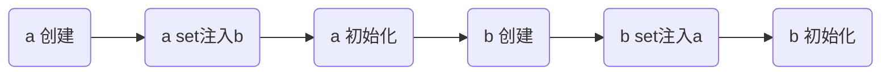
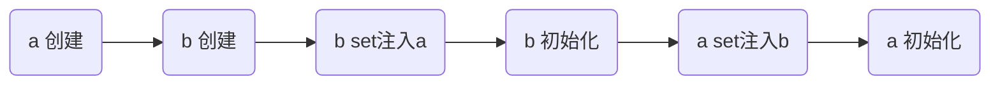
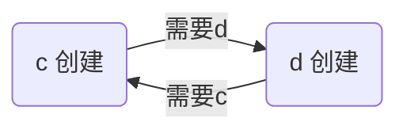
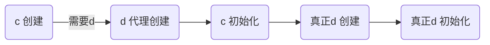
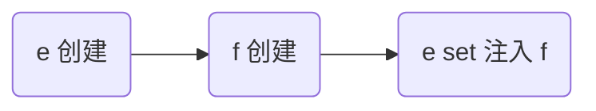
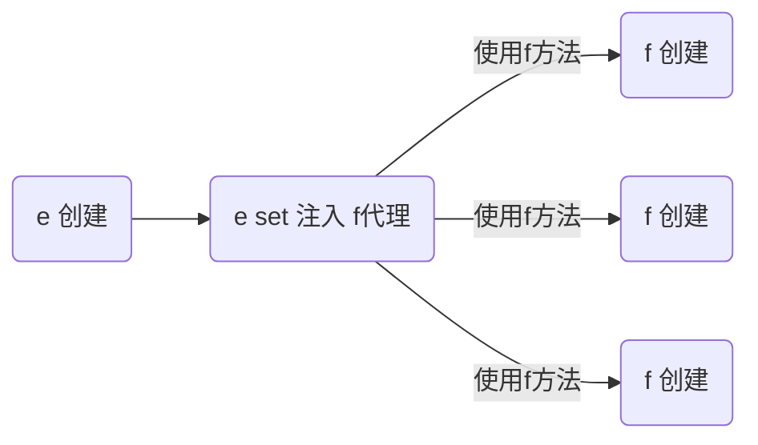

# 1. Spring Boot 高级

## :star:1.1 @SpringBootApplication

@SpringBootApplication 是一个组合注解，由以下三个注解组成

* @SpringBootConfiguration
* @ComponentScan
* @EnableAutoConfiguration


下面分别讲解 @SpringBootConfiguration 与 @EnableAutoConfiguration

### 1) @Configuration

@SpringBootConfiguration 又被标注了 @Configuration 注解，此注解表示被标注的类是一个【配置类】，在它内部可以定义 @Bean 来管理自己的或第三方的 bean，例如

```java
@Configuration
public class MyConfig1 {

    @Bean
    public MyBean myBean(){
        return new MyBean();
    }
}
```

* 当项目规模较大时，把所有的配置都集中在引导类中不方便管理，此时可以拆分为多个 @Configuration 配置类
* 标注了 @Configuration 的 MyConfig1 本身也作为一个 bean 被 Spring 引导类扫描到，它可以视为其它 @Bean 的工厂，那些标注了 @Bean 的方法即为工厂方法
* 引导类因为间接标注了 @Configuration，因此引导类本质上也是一个配置类

### 2) @SpringBootConfiguration

@SpringBootConfiguration 相对 @Configuration 多出的功能是：

* 让 @SpringBootTest 测试类能够找到它
* 一个应用中应该只有一个 @SpringBootConfiguration 标注的类


### 3) @EnableAutoConfiguration

这种以 Enable 打头的一些注解，其本质是利用了 @Import，因此先来学习一下 @Import 注解

### 4) @Import

如果新增的配置类不在引导类的扫描范围内，那么该配置类和其中的 bean 并不会出现在容器中，这时可以用 @Import 来引入

有一个管 dao 的配置类

```java
@Configuration
public class MyDaoConfig {

    @Bean
    public MyDao1 myDao1() {
        return new MyDao1();
    }

    @Bean
    public MyDao2 myDao2() {
        return new MyDao2();
    }
}
```

可以通过 @Import 把它们加入引导类所在容器

```java
@SpringBootApplication
@Import(MyDaoConfig.class)
public class DemoApplication {
    // ...
}
```

怎么验证呢，看看这些 bean 是否在容器中即可

```java
@SpringBootApplication
@Import(MyDaoConfig.class)
public class DemoApplication {

    public static void main(String[] args) {
        ConfigurableApplicationContext context = SpringApplication.run(DemoApplication.class, args);
        System.out.println(context.containsBean("myBean"));
        System.out.println(context.containsBean("myDao1"));
        System.out.println(context.containsBean("myDao2"));
    }

}
```

都应当输出 true

目录结构参考如下

```
com
  |- itheima
    |- config
    	|- MyDaoConfig(在扫描范围外, 管两个 Dao)
  	|- demo
		|- DemoApplication
		|- MyConfig1(能被扫描到, 管MyBean)
		|- bean
			|- MyBean
		|- dao
			|- MyDao1
			|- MyDao2
```


@Impot 导入类时，导入的 class 可以是以下四种

* 该 class 是【配置类】
* 该 class 是普通类
* 该 class 实现了 ImportSelector 接口
* 该 class 实现了 ImportBeanDefinitionRegistrar 接口

第一种方式前面演示过了，第四种方式属于高级用法，很少用到，下面演示中间两种用法

导入 class 就是个普通类

```java
@SpringBootApplication
@Import(MyDao3.class)
public class DemoApplication {
	// ...
}
```

效果是把 MyDao 这个普通类的实例对象，纳入 Spring 容器管理


导入 class 实现了 ImportSelector 接口，例如有下面的类

```java
public class MyImporter implements ImportSelector {
    @Override
    public String[] selectImports(AnnotationMetadata importingClassMetadata) {
        return new String[]{
                "com.itheima.demo.dao.MyDao4",
                "com.itheima.demo.dao.MyDao5"
        };
    }
}
```

```java
@SpringBootApplication
@Import(MyDao3.class, MyImporter.class)
public class DemoApplication {
	// ...
}
```

验证

```java
@SpringBootApplication
@Import({MyDao3.class, MyImporter.class})
public class DemoApplication {

    public static void main(String[] args) {
        ConfigurableApplicationContext context = SpringApplication.run(DemoApplication.class, args);
        // ...
        System.out.println(context.containsBean("com.itheima.demo.dao.MyDao3"));
        System.out.println(context.containsBean("com.itheima.demo.dao.MyDao4"));
        System.out.println(context.containsBean("com.itheima.demo.dao.MyDao5"));
    }

}
```

解读

* MyImportSelector 本身并不会被 Spring 容器当作 bean
* selectImports 方法返回的类名数组中，如果有【配置类】，仍会按配置类规则引入，请自行验证
* 注意用这两种方法引入 bean，bean 的名字是类全名

目录结构参考如下

```
com
  |- itheima
    |- config
    	|- MyImporter
  	|- demo
		|- DemoApplication
		|- dao
			|- MyDao3
			|- MyDao4
			|- MyDao5
```


### 5) 条件装配

当扫描或是 @Import 的 @Service 等组件、@Configuration 配置类、@Bean 等有时期望满足一定条件才能被 Spring 管理，不满足则不管理，怎么做呢？

比如条件是【类路径下必须有 dataSource】这个 bean ，在 SpringBoot 中可以在目标 bean 上添加 `@ConditionalOnClass("com.alibaba.druid.pool.DruidDataSource")`，表示目标 bean 满足了此条件，才会被 Spring 管理，例如：

目录结构如下

```
com
  |- itheima
  	|- demo
		|- DemoApplication
		|- MyConfig2(能被扫描到, 管 myDao7,myDao8 带条件)
		|- dao
			|- MyDao6(能被扫描到, 带条件)
			|- MyDao7
			|- MyDao8
```

可以配合普通组件使用，例如下面的 dao 被扫描到后，会执行条件检查

```java
@Repository
@ConditionalOnClass("com.alibaba.druid.pool.DruidDataSource")
public class MyDao6 {
}
```

也可以配合配置类使用，类上加了 `@Conditional(DruidPresent.class)` 表示整个配置类会执行条件检查

```java
@Configuration
@ConditionalOnClass("com.alibaba.druid.pool.DruidDataSource")
public class MyConfig2 {
    @Bean
    public MyDao7 myDao7() {
        return new MyDao7();
    }
    @Bean
    public MyDao8 myDao8() {
        return new MyDao8();
    }
}
```

分别测试加入和去除 druid 依赖，观察 myDao6, myDao7, myDao8 是否存在于容器

```xml
<dependency>
    <groupId>com.alibaba</groupId>
    <artifactId>druid</artifactId>
    <version>1.1.17</version>
</dependency>
```

@Bean 方法上加了 `@ConditionalOnClass("com.alibaba.druid.pool.DruidDataSource")`  表示仅此方法会执行条件检查，这个请大家自行测试

Spring Boot 提供的常见条件装配注解有：

* @ConditionalOnClass - 类路径下必须有某个类，条件才成立
* @ConditionalOnMissingClass - 类路径下缺少某个类，条件才成立
* @ConditionalOnBean - 容器中必须有某个 bean，条件才成立
* @ConditionalOnMissingBean - 容器中缺少某个 bean，条件才成立
* @ConditionalOnProperty - 配置中必须满足某项条件


### :star:6) 自动配置类

有了以上的铺垫，就可以来学习一下 @EnableAutoConfiguration 是如何让自动配置类生效的

#### 位置

@EnableAutoConfiguration 内部就是利用了 @Import 的第三种方式，来导入自动配置类。那么这些自动配置来从何而来呢？在引入了起步依赖后，就会间接引入自动配置的依赖，例如前面见到的 

* `spring-boot-starter-web` 引入了以后会间接加入 `spring-boot-autoconfigure`
* `mybatis-spring-boot-starter` 引入了以后会间接加入 `mybatis-spring-boot-autoconfigure`
* 就是这些命名为 `xxx-autoconfigure` 的依赖提供了自动配置类，自动配置类名一般以 xxxAutoConfiguration 结尾
* 具体有哪些自动配置类是在 jar 包的 `\META-INF\spring.factories` 这个固定位置，例如：
  * spring-boot-autoconfigure-2.5.5.jar!\META-INF\spring.factories


#### 解析顺序

自动配置解析时的优先级较低，解析顺序为：

```mermaid
graph LR

s(Spring容器)
o("@Component,@Bean...")
a(自动配置类)

s--解析-->o
o--解析-->a

```

以 dataSource 的配置为例，工作方式如下：

检查 Spring 容器中是否配置过 dataSource

* 如果配过（用 @Bean），因为 @Bean 的优先级高，自动配置则不会生效
* 如果没配过，再检查自动配置

#### 生效条件

如果有多个类似的自动配置，究竟哪个是否生效就是利用了前面讲的条件装配，以 dataSource 的自动配置为例：

* Spring Boot 2.x 默认引入的 dataSource 实现是 HikariCP 连接池，这时 HikariCP 的自动配置就会生效
* Spring Boot 还同时支持 tomcat jdbc 等连接池自动配置，只是 classpath 下没有它们依赖的 jar 包，因此条件不成立，这些自动配置未能生效

下面实际替换一下 dataSource 自动配置，从默认的 HikariCP 改为 tomcat jdbc，如果引入 tomcat jdbc 连接池的依赖，并排除 HikariCP 的依赖，则 tocmat jdbc 的自动配置就会生效

步骤1 - 修改 pom.xml

```xml
<?xml version="1.0" encoding="UTF-8"?>
<project xmlns="http://maven.apache.org/POM/4.0.0" xmlns:xsi="http://www.w3.org/2001/XMLSchema-instance"
         xsi:schemaLocation="http://maven.apache.org/POM/4.0.0 https://maven.apache.org/xsd/maven-4.0.0.xsd">
    
	...

    <dependencies>
        ...

        <dependency>
            <groupId>org.mybatis.spring.boot</groupId>
            <artifactId>mybatis-spring-boot-starter</artifactId>
            <version>2.1.4</version>
            <exclusions>
                <exclusion>
                    <groupId>com.zaxxer</groupId>
                    <artifactId>HikariCP</artifactId>
                </exclusion>
            </exclusions>
        </dependency>

        <dependency>
            <groupId>org.apache.tomcat</groupId>
            <artifactId>tomcat-jdbc</artifactId>
        </dependency>

    </dependencies>

    ...

</project>

```

步骤2 - 验证是否配置成功，检查连接池是否切换到了 tomcat-jdbc


## 1.2 内嵌 web 容器

一个值得注意的地方是 Spring Boot 不再需要将应用部署到 Tomcat 服务器才能运行，这是因为它内嵌了 Tomcat 服务器

简单对比一下：

* 传统 web 程序，打 war 包，部署至 Tomcat，是 Tomcat 中运行了 Spring 程序
* Spring Boot web 程序，打 jar 包，启动内嵌的 Tomcat，是 Spring 程序驱动了 Tomcat
  * 优点：控制力更强了👍，原本不好管理的 Servlet、Filter 等都可以轻易使用 Spring 依赖注入等功能
  * 优点：部署也更为方便👍，不需要单独安装 tomcat，有 java 运行环境即可
  * 缺点：jar 包不支持 jsp

在引导类上添加 @ServletComponentScan 就可以将 Filter、Servlet 等纳入 Spring 管理
引导类

```java
@SpringBootApplication
@MapperScan
// 扫描 Servlet 组件
@ServletComponentScan
public class SpringCaseBoot01Application {

    // ...

}
```

MyFilter

```java
@WebFilter("/*")
public class MyFilter implements Filter {

    private static final Logger log = LoggerFactory.getLogger(MyFilter.class);

	// 测试是否能正确注入其它 bean
    @Autowired
    private DogService dogService;

    @Override
    public void doFilter(ServletRequest request, ServletResponse response, FilterChain chain) throws IOException, ServletException {
        log.debug("filter...{}", dogService);
        chain.doFilter(request, response);
    }
}
```

支持的内嵌 web 容器有三种

* tomcat
* jetty
* undertow

对应的起步依赖分别为

tomcat （默认）

```xml
<groupId>org.springframework.boot</groupId>
<artifactId>spring-boot-starter-tomcat</artifactId>
```

jetty

```xml
<groupId>org.springframework.boot</groupId>
<artifactId>spring-boot-starter-jetty</artifactId>
```

undertow

```xml
<groupId>org.springframework.boot</groupId>
<artifactId>spring-boot-starter-undertow</artifactId>
```

可以用之前学习的排除依赖的方法，在这几种 web 容器之间进行切换


## 1.3 多环境配置

Spring Boot 也支持 profile，为不同的环境提供不同的配置，它提供两种方式的 profile

### 1) profile 分成多个文件

再提供两个 properties 文件，文件名称格式为 `application-{profile名称}.properties`：
application-development.properties，即 profile 名称为 `development`，内容为

```properties
server.port=8050
```

application-production.properties，即 profile 名称为 `production`，内容为

```properties
server.port=8040
```

启动时，填写 profile 名称

其实就是在程序启动时添加了虚拟机参数：`-Dspring.profiles.active=production` 可以在启动日志里看到

可以看到结果使用了 application-production.properties 文件中配置的 8040 端口

* 如果不指定 profile，会采用 application.properties 中的设置
* profile 中不包含的设置，会采用 application.properties 中的
* 最后了解：如果同时制定了多个 profile，最后一个 profile 的配置会生效

### 配置优先级

思考一个问题，当打包完毕后，将 jar 包部署至服务器，发现某一项配置错了，或者是服务器的环境要求修改配置，难道要重新打包吗？

其实不必，Spring Boot 支持外部配置，而且外部配置的优先级高于 jar 包内配置的优先级。常用的几种配置优先级从低到高列举如下：

* application.properties，项目内部（classpath 下）
* application-{profile}.properties，项目内部（classpath 下）
* application.properties，项目外部（与 jar 包平级）
* application-{profile}.properties，项目外部（与 jar 包平级）
* 操作系统环境变量（OS environment variables）
* Java 系统属性（Java System properties）
* 命令行参数（Command line arguments）

测试1：外部 application.properties（端口号改为 8060）

```cmd
java -jar .\spring_case_boot_01-0.0.1-SNAPSHOT.jar
```

测试2：操作系统环境变量
如果用 cmd 黑窗口（set 设置的环境变量不跨窗口，可以用 `echo %变量名%` 查看）

```cmd
set SERVER_PORT=8030
java -jar .\spring_case_boot_01-0.0.1-SNAPSHOT.jar
```

如果用 powershell

```powershell
$env:SERVER_PORT=8030
java -jar .\spring_case_boot_01-0.0.1-SNAPSHOT.jar
```

测试3：Java 系统属性
如果用 cmd 黑窗口

```cmd
java -Dserver.port=8020 -jar .\spring_case_boot_01-0.0.1-SNAPSHOT.jar
```

如果用 powershell

```powershell
java --% -jar -Dserver.port=8020 .\spring_case_boot_01-0.0.1-SNAPSHOT.jar
```

--% 是 powershell 中必须加的，否则脚本会执行错误

测试4：命令行参数
如果用 cmd 黑窗口

```cmd
java -Dserver.port=8020 -jar .\spring_case_boot_01-0.0.1-SNAPSHOT.jar --server.port=8010
```

如果用 powershell

```powershell
java --% -jar -Dserver.port=8020 .\spring_case_boot_01-0.0.1-SNAPSHOT.jar --server.port=8010
```

平时我们测试，不想改动操作系统环境变量，可以在 idea 中以等效的方式配置它们


* ① 处配置命令行参数
* ② 处配置虚拟机参数（Java 系统属性）
* ③ 处配置系统环境变量
* ④ 处配置激活的 profile

## 1.4 提高

### :u6e80:1) 循环依赖

spring 容器中一个 bean 从创建到能够被使用，需要经历3个阶段，此顺序不能颠倒，并且只发生一次！


#### 单例 set 循环依赖

单例 set 循环依赖**无需任何配置**，Spring 会自动调整执行顺序

```java
@Component
public class A {
    @Autowired
    private B b;
    // ...
}

@Component
public class B {
    @Autowired
    private A a;
    // ...
}
```

为了方便说明，把各阶段都进行打印输出

```java
@Component
public class A {

    private static final Logger log = LoggerFactory.getLogger(A.class);

    private B b;

    public A() {
        log.info("A()");
    }

    @Autowired
    public void setB(B b) {
        this.b = b;
        log.info("setB(B b)");
    }

    @PostConstruct
    public void init() {
        log.info("init()");
    }

    public B getB() {
        return b;
    }
}
```


```java
@Component
public class B {

    private static final Logger log = LoggerFactory.getLogger(B.class);

    private A a;

    public B() {
        log.info("B()");
    }

    @Autowired
    public void setA(A a) {
        this.a = a;
        log.info("setA(A a)");
    }

    @PostConstruct
    public void init() {
        log.info("init()");
    }

    public A getA() {
        return a;
    }
}
```

分析：顺序【不可能】是



因为执行到 `a set注入b` 时，b 还没有，因此 Spring 会调整这个顺序



验证输出

```
com.itheima.demo.cyclic.A                : A()
com.itheima.demo.cyclic.B                : B()
com.itheima.demo.cyclic.B                : setA(A a)
com.itheima.demo.cyclic.B                : init()
com.itheima.demo.cyclic.A                : setB(B b)
com.itheima.demo.cyclic.A                : init()
```


#### 构造循环依赖

```java
@Component
public class C {
	private D d;

    public C(D d) {
        this.d = d;
        log.info("C(D d)");
    }
}

@Component
public class D {
    private C c;

    public D(C c) {
        this.c = c;
        log.info("D(C c)");
    }
}
```

为了方便说明，把各阶段都进行打印输出

```java
@Component
public class C {
    private static final Logger log = LoggerFactory.getLogger(C.class);

    private D d;

    public C(D d) {
        this.d = d;
        log.info("C(D d)");
    }

    public D getD() {
        return d;
    }

    @PostConstruct
	public void init() {
        log.info("init()");
    }

}
```


```java
@Component
public class D {
    private static final Logger log = LoggerFactory.getLogger(D.class);

    private C c;

    public D(C c) {
        this.c = c;
        log.info("D(C c)");
    }

    public C getC() {
        return c;
    }

    @PostConstruct
	public void init() {
        log.info("init()");
    }

}
```

输出

```
***************************
APPLICATION FAILED TO START
***************************

Description:

The dependencies of some of the beans in the application context form a cycle:

┌─────┐
|  c defined in file [com\itheima\demo\cycle\C.class]
↑     ↓
|  d defined in file [com\itheima\demo\cycle\D.class]
└─────┘
```


#### 分析



解决方法，在 C 或 D 任意一方的构造上添加 @Lazy 注解

```java
@Component
public class C {

    @Lazy
    public C(D d) {
        this.d = d;
        log.info("C(D d)");
    }

    // ...

}
```

输出

```
com.itheima.demo.cycle.C                 : C(D d)
com.itheima.demo.cycle.C                 : init()
com.itheima.demo.cycle.D                 : D(C c)
com.itheima.demo.cycle.D                 : init()
```

原理是：创建一个【代理d】你先用着，等以后用到【真正d】，通过【代理d】间接访问



如何验证给 C 注入的 D 是代理对象呢？

```java
System.out.println(context.getBean(C.class).getD().getClass());
```

会输出

```
class com.itheima.demo.cycle.D$$EnhancerBySpringCGLIB$$641de176
```

从类名上可以看出，`D$$EnhancerBySpringCGLIB$$641de176` 以后看到类似的类名，说明该类是代理类，底层使用了 CGLIB 技术生成代理


> ***注意***
>
> * 多例 set 循环依赖、多例构造循环依赖，Spring 都不能自动解决
> * 解决方法还是需要主动采用 @Lazy，加在依赖的成员变量、构造方法、或是成员方法上
> * @Lazy 是解决循环依赖的方法之一，最为简单
> * @Lazy 不能加在 D 类上，加在类上的含义是推迟 D 的创建，不会生成代理，加在方法上才能生成代理


### :u6e80:2) 单例注入多例

有一个单例对象 E

```java
@Component
public class E {
    private static final Logger log = LoggerFactory.getLogger(E.class);

    private F f;

    public E() {
        log.info("E()");
    }

    @Autowired
    public void setF(F f) {
        this.f = f;
        log.info("setF(F f) {}", f.getClass());
    }

    public F getF() {
        return f;
    }
}
```

要注入的对象 F 期望是多例

```java
@Component
@Scope("prototype")
public class F {
    private static final Logger log = LoggerFactory.getLogger(F.class);

    public F() {
        log.info("F()");
    }
}
```

测试

```java
E e = context.getBean(E.class);
F f1 = e.getF();
F f2 = e.getF();
System.out.println(f1);
System.out.println(f2);
```

输出

```
com.itheima.demo.cycle.F@6622fc65
com.itheima.demo.cycle.F@6622fc65
```

发现它们是同一个对象，而不是期望的多例对象


#### 分析

对于单例对象来讲，依赖注入仅发生了一次，后续再没有用到多例的 F，因此 E 用的始终是第一次依赖注入的 F



解决

* 仍然使用 @Lazy 生成代理
* 代理对象虽然还是同一个，但当每次**使用代理对象的任意方法**时，由代理创建新的 f 对象



```java
@Component
public class E {

    @Autowired
    @Lazy
    public void setF(F f) {
        this.f = f;
        log.info("setF(F f) {}", f.getClass());
    }

    // ...
}
```

> ***注意***
>
> * @Lazy 加在也可以加在成员变量上，但加在 set 方法上的目的是可以观察输出，加在成员变量上就不行了
> * @Autowired 加在 set 方法的目的类似

输出

```
E: setF(F f) class com.itheima.demo.cycle.F$$EnhancerBySpringCGLIB$$8b54f2bc
F: F()
com.itheima.demo.cycle.F@3a6f2de3
F: F()
com.itheima.demo.cycle.F@56303b57
```

从输出日志可以看到调用 setF 方法时，f 对象的类型是代理类型


* 