## spring和springboot简介

### spring简介

Spring基础的是 Spring Framework，其功能有：

- **IoC – 控制反转，Spring 两大核心技术之一**
- **AOP – 面向切面编程，Spring 两大核心技术之一**
- 事务 - 无需编写代码，即可实现数据库事务管理
- 测试 - 与测试框架集成、web 单元测试
- MVC - 开发 web 应用程序
- 缓存 - 对缓存进行抽象
- 调度 - 延时任务、定时任务

Spring Framework 在开发中的作用：

- **分层解耦 - 让单体应用的可扩展性更强**
- **整合框架 - 整合第三方框架，使之协同工作**
- 实用技术 - 自身强大，提供各种实用功能

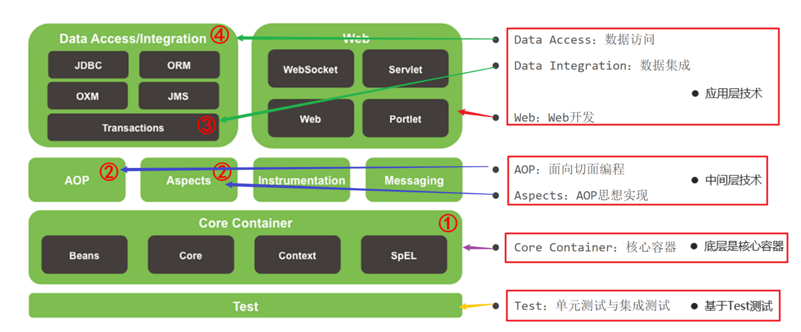

### springboot简介

Spring Boot 去除了大量的 XML 配置文件，简化了复杂的依赖管理。

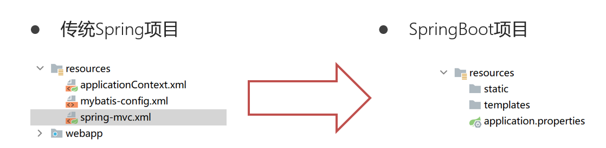

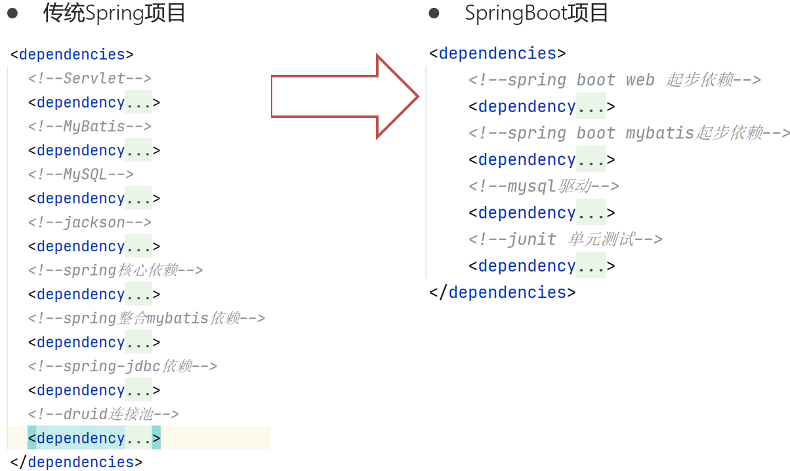

## springboot快速入门

### 第一步:创建springboot项目

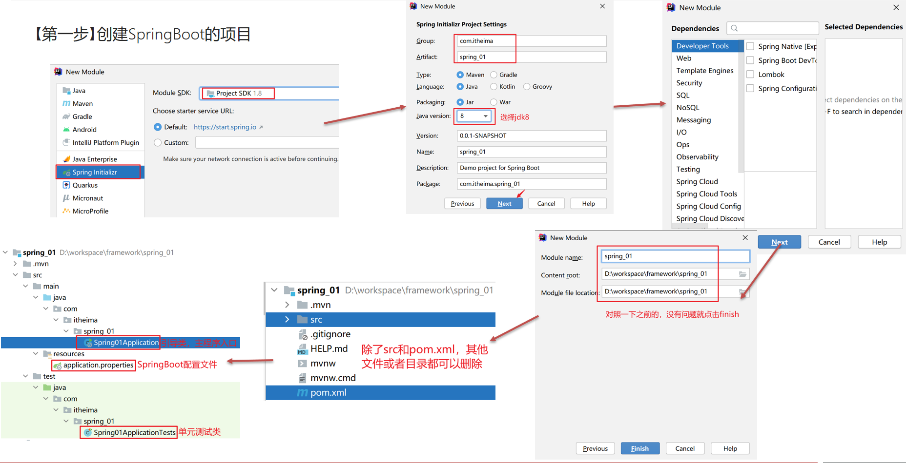

### 第二步:创建UserService接口和UserServiceImplA实现类

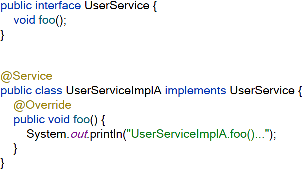

### 第三步在引导类中获取UserService实现类对象，并调用方法

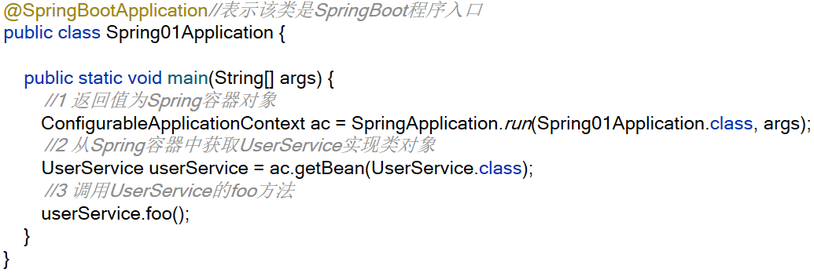

## 控制反转（Ioc）

### Ioc概念

控制反转：（Inversion of Control，缩写为IoC）把**创建对象**的权利交给Spring，由Spring创建Bean对象并保存到Spring容器中，也叫IoC容器。

### 加载Bean

当Spring扫描到以下注解时，就会创建Bean对象保存到Spring容器中

- @Component –写在类上，把**普通类**交给 Spring管理，这个类不属于三层架构中的类
- @Controller - 写在类上，把**控制器类**交给 Spring管理
- @Service - 写在类上，把**业务层类**交给 Spring管理
- @Repository - 写在类上，把**数据访问层类**交给Spring管理

**注意**：Spring默认是加载引导类/启动类所在包及其子包中所有带有以上注解的类，创建这些类的对象，保存到Spring容器中。

如果Bean不在引导类/启动类所在包及其子包中，那么就需要在引导类上使用@ComponentScan(“要扫描的包”)注解指定要加载哪个包中的Bean

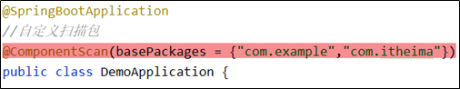

### 获取Bean

Spring容器启动时，会把其中的bean都创建好，如果想要主动获取这些 bean，可以使用容器的如下方法

1. 根据类型获取 bean - *<T> T* *getBean(Class<T>*  requiredType)
   - 可以传递父类型，返回子类型
   - 可以传递接口类型，返回实现类型
2. 根据名称获取 bean - *Object*  getBean(String name)
3. 根据名称和类型获取 bean - *<T> T* *getBean(String name, Class<T>* requiredType)

### Bean的范围

在类上使用@scope注解定义Bean的作用域，Spring支持五种作用域，后三种在web环境才生效。

1. **singleton** - 容器内同名称的 bean 只有一个实例（**默认**）
2. **prototype** - 每次使用该 bean 时会创建新的实例
3. request - 在 web 环境中，每个请求范围内会创建新的实例
4. session - 在 web 环境中，每个会话范围内会创建新的实例
5. application- 在 web 环境中，每个应用范围内会创建新的实例

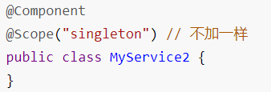

### Bean的生命周期

1. 标注了 **@PostConstruct** 的方法是初始化方法，会在bean被创建之后调用。
2. 标注了 **@PreDestroy** 的方法是销毁方法，singleton范围的bean的销毁方法会在容器关闭前被调用。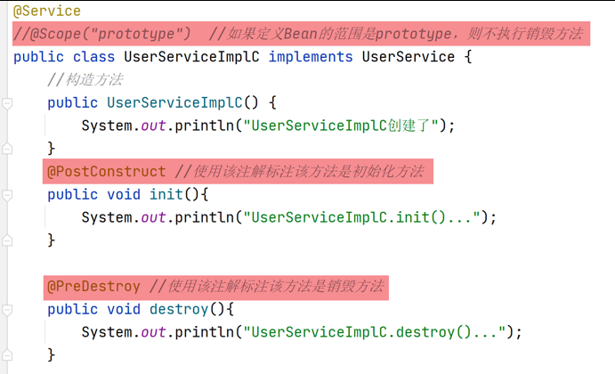
3. 默认情况下singleton范围的bean是容器创建时就会创建，但是可以配置延迟初始化.     如果希望**用到时才创建**，可以使用 **@Lazy** 注解标注在类上来延迟创建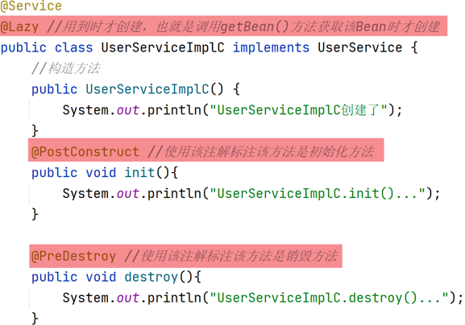

### 管理第三方Bean

使用@Configuration注解定义配置类，在配置类中定义方法使用**@Bean**注解将方法返回的对象保存到Spring容器中。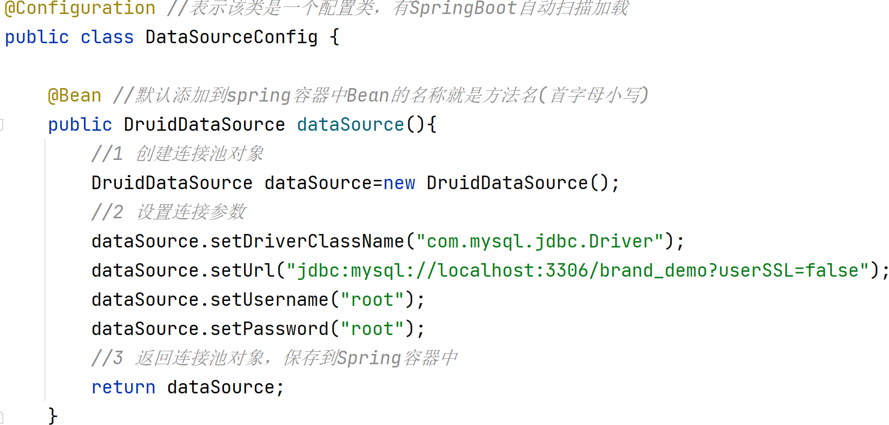

## 依赖注入（DI）

依赖注入：Dependency Injection，缩写为DI。就是指被 Spring管理的Bean对象之间的依赖关系。由**Spring**容器完成对象属性的赋值。

依赖注入相关的注解有

1. 给对象类型的属性赋值
   - @Autowired
   - @Qualifier
2. 给普通类型的属性赋值
   - @Value
   - @ConfigurationProperties

### 给对象类型的属性赋值

#### @Autowired

作用：给对象类型的属性赋值，可以用在成员变量、成员方法、构造方法上

1. 加在成员变量上，根据成员变量的**类型**到容器中找类型匹配的bean进行注入(赋值)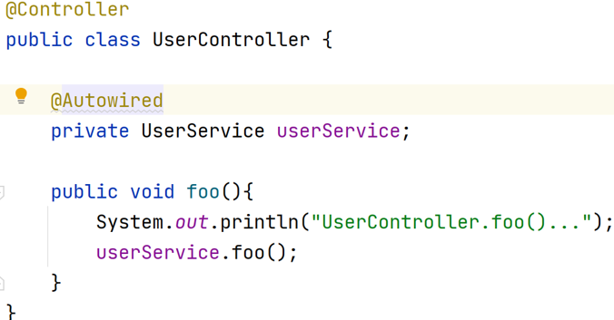

2. 加在普通方法上，根据方法的参数**类型**到容器中找类型匹配的bean进行注入(赋值)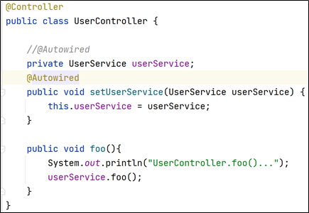

3. 加在构造方法上，根据构造方法的参数类型到容器中类型匹配的bean进行注入(赋值)

   要求：有参构造方法唯一。如果有空参构造，则Spring默认使用空参构造创建对象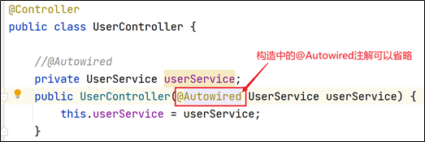

#### @Qualifier

使用@Autowired给对象类型的属性赋值，如果同类型的对象有多个，就按照变量名和Bean的名称进行匹配，建议使用@Qualifier注解指定要匹配的Bean的名称。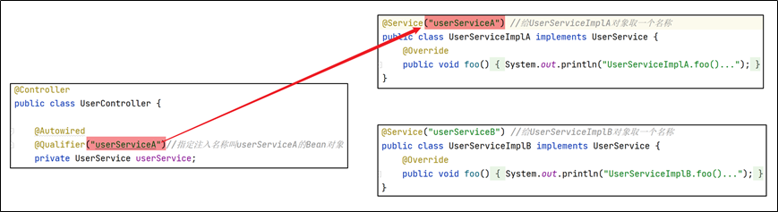

### 给普通类的属性赋值

作用：给普通类型(基本类型、包装类类型、Sring类型)的属性赋值。

#### @Value

Spring Boot采用**application.properties** 作为配置文件，可以使用 **@Value**注解结合EL表达式根据key读取配置文件中对应的value值。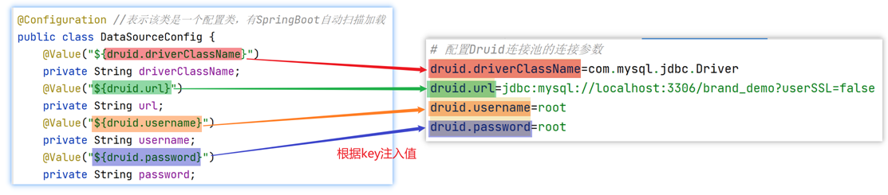

#### @ConfigurationProperties

批量注入普通属性值

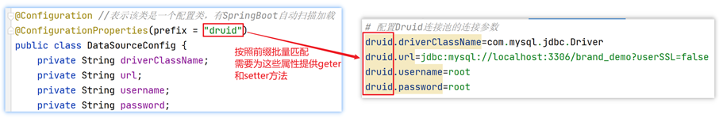

## 拔高知识

### springboot整合junit

测试类上的@SpringBootTest注解表示该类是一个SpringBoot单元测试类，在该测试类中可以直接使用@Autowired注解注入要使用对象。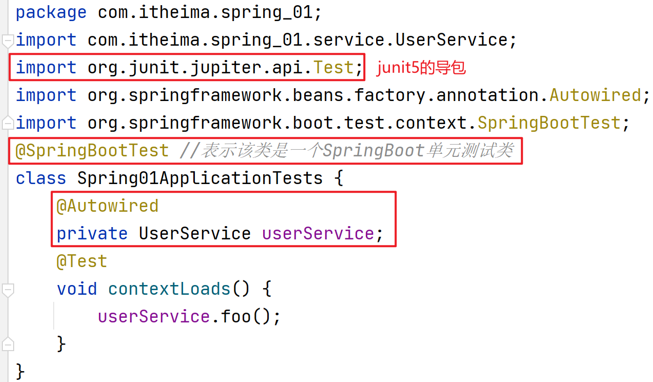

注意：单元测试类所在包要在引导类所在包及其子包下，否则需要指定引导类：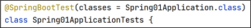

### lombok工具包

```xml
<!--lombok-->
 <dependency>
   <groupId>org.projectlombok</groupId>
   <artifactId>lombok</artifactId>
 </dependency>
```

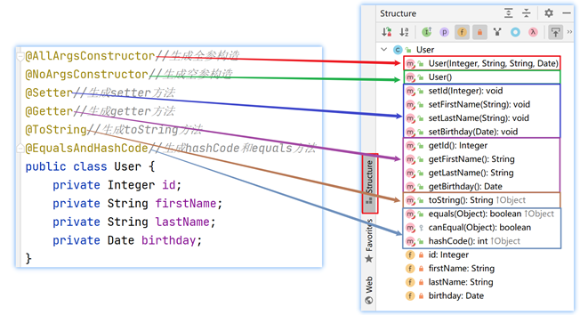

#### @Data注解

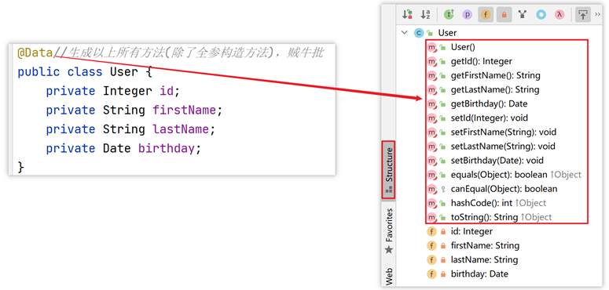

#### @Slf4j注解

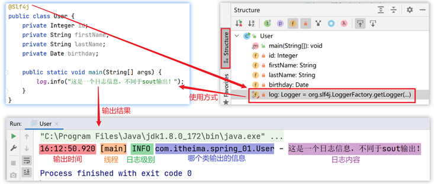

### spring循环依赖

#### set方式循环依赖

bean 从创建到初始化三个阶段，此顺序不能颠倒，并且只发生一次！

set方式循环依赖现象：

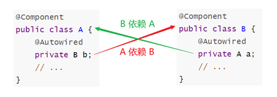

Springboot2.6.0之前，set循环依赖**无需任何配置**，Spring 会自动调整执行顺序

**注意：从**SpringBoot2.6.0开始，SpringBoot默认不会自动解决set方式循环依赖，需要在application.propertes开启自动解决循环依赖。

#### 构造方式循环依赖

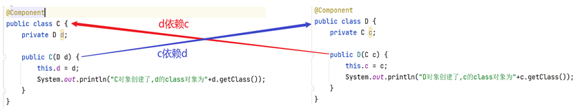

需要在启动一个Bean构造方法中使用@Lazy注解，表示创建依赖对象的代理对象而不是真实对象进行注入。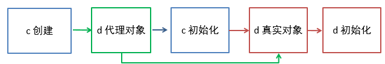

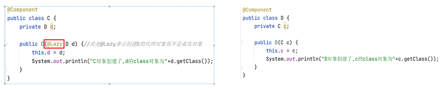